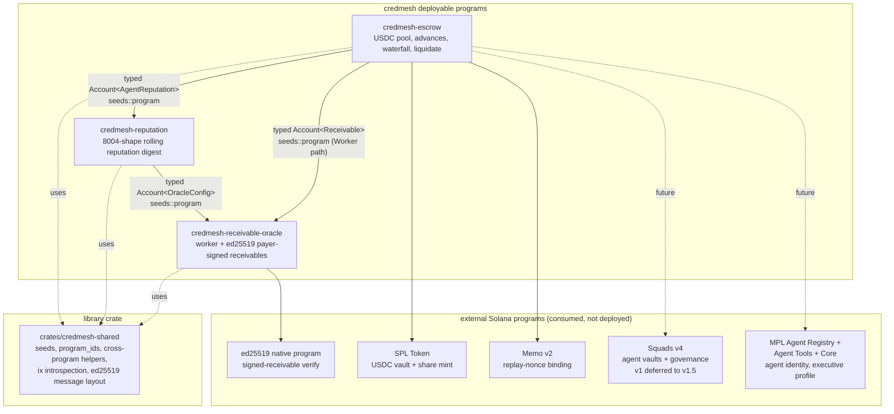
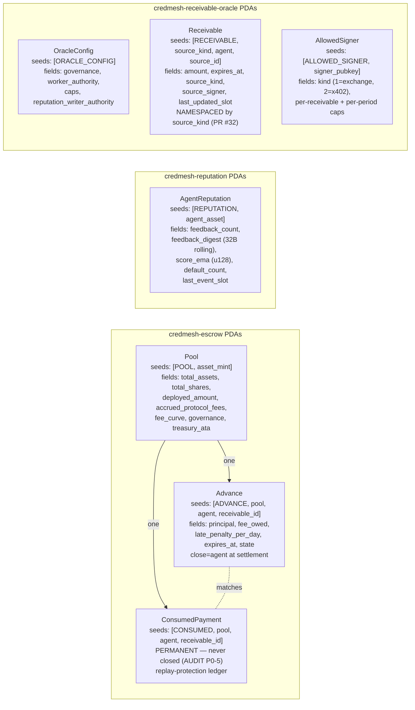
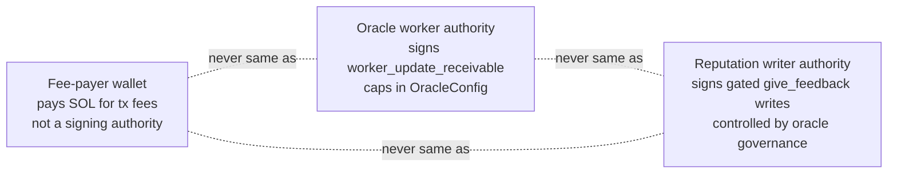

# Architecture

CredMesh-Solana is a programmable credit protocol for autonomous agents on Solana. Three deployable programs + one shared library crate.

## High-level



## Per-program PDAs



## Three-key topology (DESIGN §10)

Three off-chain authorities that MUST never share keys:



If any two collapse to the same key, a single compromise yields cross-protocol takeover. Rotation flow lives in `DEPLOYMENT.md`.

## Workspace layout

```
programs/
  credmesh-escrow/                  Pool vault + share mint + advance issuance + waterfall settlement + liquidate
  credmesh-reputation/              AgentReputation 8004-shape rolling-digest reputation + writer-gated EMA updates
  credmesh-receivable-oracle/       Worker-attested + ed25519 payer-signed receivables + allowed-signer registry
crates/
  credmesh-shared/                  LIBRARY ONLY (not deployed). Seed constants, program-ID consts, cross-program
                                    helpers (read_cross_program_account 4-step verify), ix introspection
                                    (verify_prev_ed25519, require_memo_nonce), ed25519_message layout
ts/server/                          Hono backend (SIWS auth, tx-builder, webhook ingress)
tests/bankrun/                      anchor-bankrun: pure-math + scaffolded harness suites by program/attack class
scripts/                            deploy.ts, init_oracle.ts, init_pool.ts + lib helpers
target/deploy/                      Committed devnet program keypairs (escrow, reputation, receivable_oracle)
```

## Cross-program data flow at a glance

| Caller | Reads | Writes | Purpose |
|---|---|---|---|
| escrow.request_advance | reputation.AgentReputation, oracle.Receivable (Worker), or instructions sysvar (ed25519/x402) | escrow.Pool, escrow.Advance, escrow.ConsumedPayment | issue an advance |
| escrow.claim_and_settle | escrow.Advance, escrow.ConsumedPayment | escrow.Pool | settle waterfall |
| escrow.liquidate | escrow.Advance, escrow.ConsumedPayment | escrow.Pool | post-deadline writeoff |
| reputation.give_feedback | oracle.OracleConfig (writer-gating + cap) | reputation.AgentReputation | append feedback + update EMA |
| oracle.worker_update_receivable | oracle.OracleConfig (worker auth + caps) | oracle.Receivable (Worker namespace) | record off-chain attested receivable |
| oracle.ed25519_record_receivable | oracle.AllowedSigner, instructions sysvar | oracle.Receivable (Exchange/X402 namespace) | record payer-signed receivable |

See `docs/LOGIC_FLOW.md` for the per-handler sequence diagrams.
