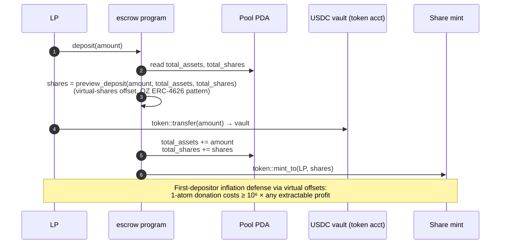
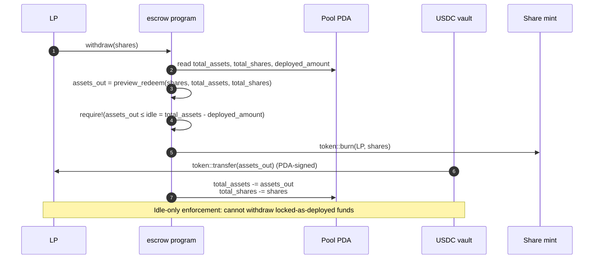
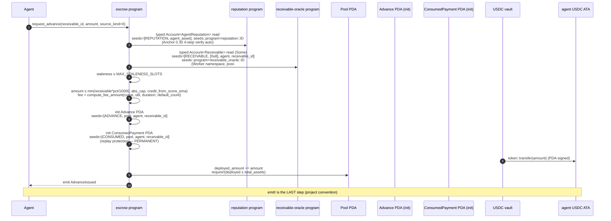
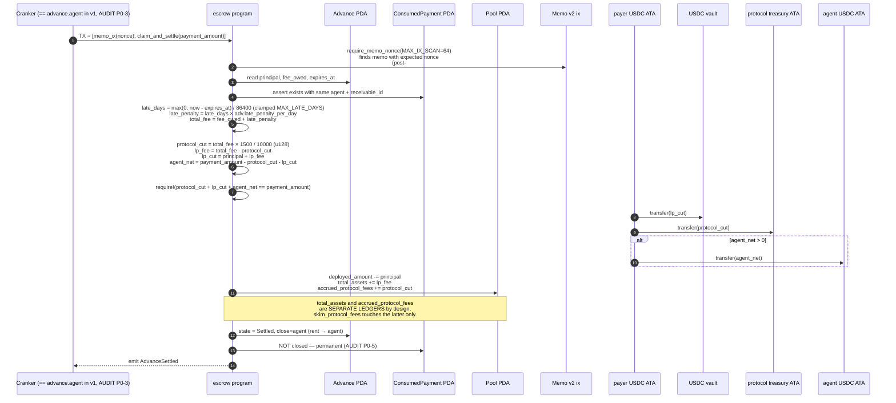
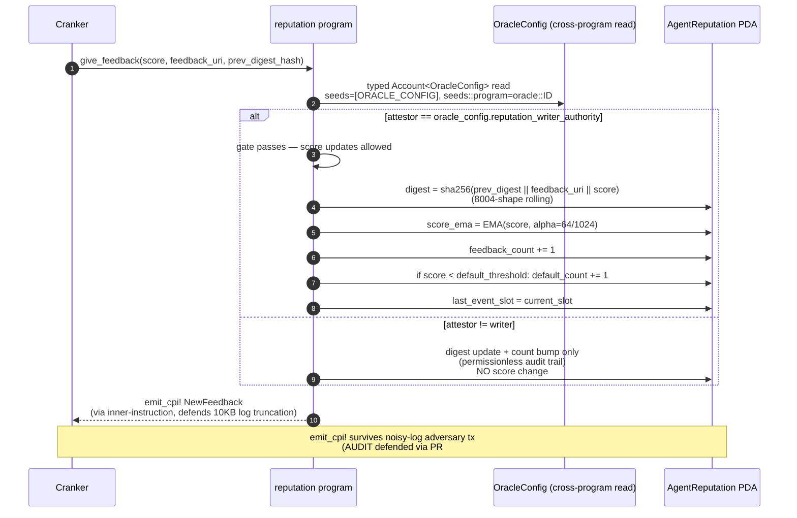
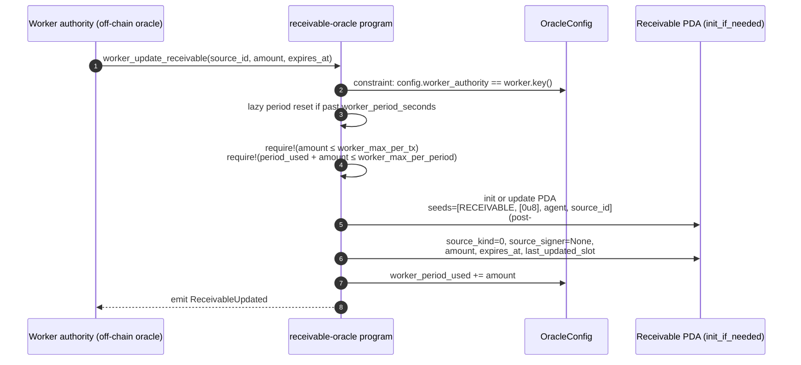

# Logic Flow

Sequence diagrams for the canonical handlers. Pair with `docs/ARCHITECTURE.md` for the static structure.

## LP deposit (`escrow::deposit`)



## Withdraw (`escrow::withdraw`)



## Request advance — Worker source path (`escrow::request_advance` source_kind=0)



## Request advance — Ed25519/X402 path (`escrow::request_advance` source_kind=1|2)

```mermaid
sequenceDiagram
    autonumber
    participant Cli as Caller (offchain)
    participant Agent
    participant ESC as escrow program
    participant Rep as reputation program
    participant Sysvar as Instructions sysvar
    participant Pool as Pool PDA
    participant Adv as Advance PDA (init)
    participant Cons as ConsumedPayment PDA (init)
    participant Vault as USDC vault
    Cli->>Cli: build SignedReceivable (96B layout)<br/>sign with allowed_signer key
    Cli->>ESC: TX = [ed25519_verify_ix, request_advance_ix]
    ESC->>Sysvar: load_instruction_at_checked(prev_ix)
    ESC->>ESC: verify_prev_ed25519(): asymmetric.re/Relay-class<br/>fix preserved (binds verify ix to current ix)
    ESC->>ESC: SignedReceivable::decode() → msg_recv_id, msg_agent,<br/>amount, expires_at, nonce
    ESC->>ESC: require!(msg_agent == agent_asset.key())<br/>(cross-agent replay defense)
    ESC->>Rep: typed Account<AgentReputation> read
    ESC->>ESC: receivable_pda = None (intentional;<br/>ed25519 path doesn't read PDA)
    ESC->>ESC: cap checks + fee calc (same as Worker)
    ESC->>ESC: init Advance + ConsumedPayment
    Vault->>Agent: token::transfer(amount) (PDA-signed)
    ESC->>Pool: deployed_amount += amount
    ESC-->>Agent: emit AdvanceIssued
```

## Settlement waterfall (`escrow::claim_and_settle`)



## Liquidation (`escrow::liquidate`)

```mermaid
sequenceDiagram
    autonumber
    participant Cranker
    participant ESC as escrow program
    participant Adv as Advance PDA
    participant Cons as ConsumedPayment PDA
    participant Pool as Pool PDA
    Cranker->>ESC: liquidate()
    ESC->>Adv: read expires_at, principal
    ESC->>ESC: require!(now ≥ expires_at + LIQUIDATION_GRACE_SECONDS)
    ESC->>Cons: assert consumed.agent == advance.agent (AUDIT P0-1)
    ESC->>Pool: deployed_amount -= principal<br/>total_assets -= principal (LPs eat the loss)
    ESC->>Adv: state = Liquidated (NOT closed — AUDIT AM-7 keeps audit trail)
    ESC->>Cons: NOT closed — permanent
    ESC-->>Cranker: emit AdvanceLiquidated
    Note over Cranker,Pool: Cannot liquidate before deadline + grace window.<br/>Share price drops; total_shares unchanged.
```

## Reputation update (`reputation::give_feedback`)



## Receivable recording — Worker path (`oracle::worker_update_receivable`)



## Receivable recording — Ed25519 path (`oracle::ed25519_record_receivable`)

```mermaid
sequenceDiagram
    autonumber
    participant Cli as Caller (offchain)
    participant Payer
    participant REC as receivable-oracle program
    participant Sysvar as Instructions sysvar
    participant AS as AllowedSigner PDA
    participant Recv as Receivable PDA (init_if_needed)
    Cli->>Cli: build 96B SignedReceivable<br/>sign with allowed_signer key
    Payer->>REC: TX = [ed25519_verify_ix, ed25519_record_receivable]
    REC->>Sysvar: verify_prev_ed25519() returns (verified_pubkey, signed_msg)
    REC->>REC: 4-layer binding:<br/>(a) ed25519 native verify<br/>(b) verified_pubkey == ix-arg signer_pubkey<br/>(c) AllowedSigner.signer == signer_pubkey<br/>(d) msg fields == ix args (recv_id, agent, amount, expires_at)
    REC->>AS: read kind, caps
    REC->>REC: lazy period reset; per-receivable + per-period cap checks
    REC->>Recv: init or update PDA<br/>seeds=[RECEIVABLE, [allowed_signer.kind], agent, source_id]<br/>(post-#32 namespaced by signer kind 1 or 2)
    REC->>Recv: source_kind=signer_acc.kind, source_signer=Some(signer_pubkey),<br/>amount, expires_at
    REC->>AS: period_used += amount
    REC-->>Payer: emit ReceivableUpdated
```

---

## Critical invariants enforced across the diagrams

| Invariant | Where | Defends |
|---|---|---|
| `deployed_amount ≤ total_assets` | request_advance post-state, withdraw pre-state | Pool can't deploy more than LPs deposited |
| `cranker == advance.agent` | claim_and_settle, liquidate constraint | AUDIT P0-3/P0-4 — v1 cranker permissioning |
| `consumed.agent == advance.agent` | claim_and_settle, liquidate | AUDIT P0-1 — cross-agent settle defense |
| ConsumedPayment PERMANENT | no close handler anywhere | AUDIT P0-5 — close-then-reinit replay defense |
| Pool has no `paused` field | state.rs | AUDIT P0-6 — issuance never gated |
| `init` (not `init_if_needed`) for replay PDAs | request_advance Advance + ConsumedPayment | AUDIT P0-5 |
| `total_assets` and `accrued_protocol_fees` = SEPARATE LEDGERS | claim_and_settle waterfall | LP price not inflated by skimmable fees |
| Memo nonce scan capped at 64 ix | require_memo_nonce | Post-#32 — DoS defense for v1.5 permissionless cranking |
| FeeCurve invariants validated at init+propose | init_pool, propose_params | Post-#32 — governance footgun guard |
| Receivable PDA namespaced by source_kind | seeds in oracle handlers | Post-#32 — cross-path overwrite defense |
